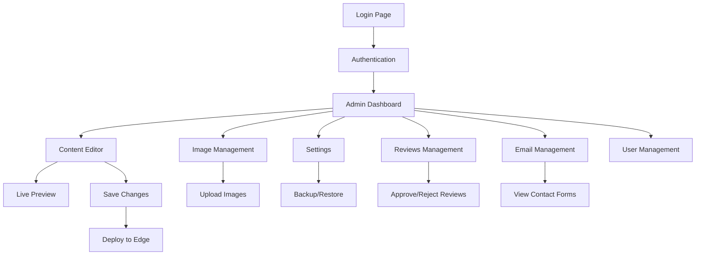
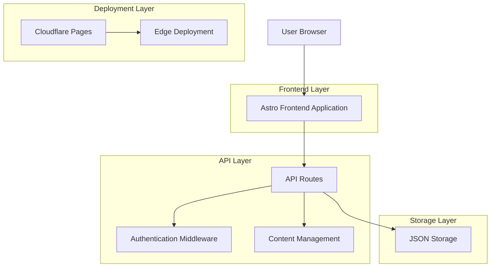

# Custom CMS Implementation Guide for Trae AI

## 1. Product Overview

A custom-built, edge-native Content Management System designed for modern web applications using Astro, TypeScript, and Cloudflare Pages. This CMS provides a lightweight, secure, and cost-effective alternative to traditional headless CMS solutions like TinaCMS, with superior performance through edge computing and custom authentication.

- **Primary Purpose**: Deliver a professional-grade CMS with edge-native performance, custom security implementation, and tailored content management capabilities for content-driven websites.
- **Target Market**: Developers and agencies seeking a self-hosted, cost-effective CMS solution with enterprise-level security and performance without the complexity and costs of traditional headless CMS platforms.

## 2. Core Features

### 2.1 User Roles

| Role | Registration Method | Core Permissions |
|------|---------------------|------------------|
| Admin | Direct credential configuration | Full access to content editing, user management, and system configuration |
| Editor | Admin invitation/creation | Content creation and editing permissions |
| Viewer | Read-only access | Content viewing and preview capabilities |

### 2.2 Feature Module

Our custom CMS consists of the following main pages:

1. **Admin Login Page**: Secure authentication with Web Crypto API, rate limiting, and session management.
2. **Admin Dashboard**: Overview of content statistics, recent changes, and quick access to management functions.
3. **Content Editor**: Visual content editing interface with live preview, structured content management, and media handling.
4. **Image Management**: Upload, organize, and manage media assets with preview capabilities.
5. **Settings Page**: System configuration, security settings, backup/restore, and deployment management.
6. **Reviews Management**: Moderate and manage customer reviews with approval workflow.
7. **Email Management**: Handle contact form submissions and email communications.
8. **User Management**: Admin user creation, role assignment, and permission management.

### 2.3 Page Details

| Page Name | Module Name | Feature Description |
|-----------|-------------|---------------------|
| Admin Login | Authentication System | Secure login with Web Crypto API JWT tokens, rate limiting, CSRF protection, and session management |
| Admin Dashboard | Overview Interface | Display content statistics, recent changes, system status, and provide quick navigation to all management functions |
| Content Editor | Visual Editor | Real-time content editing with structured data management, image upload handling, live preview, and auto-save functionality |
| Image Management | Media Library | Upload, organize, and manage images with preview, metadata editing, and file organization capabilities |
| Settings | System Configuration | Configure site settings, user management, content backup/restore, security parameters, and system maintenance |
| Reviews Management | Review Moderation | View, approve, reject, and manage customer reviews with rating display and response capabilities |
| Email Management | Communication Hub | Handle contact form submissions, view email history, and manage customer communications |
| User Management | User Administration | Create, edit, and delete admin users, assign roles, manage permissions, and track user activity |

## 3. Core Process

### Admin Workflow
1. Admin accesses login page and authenticates using secure credentials
2. System validates credentials using Web Crypto API and generates JWT token
3. Admin is redirected to dashboard with overview of content and system status
4. Admin navigates to various management sections:
   - Content editor to modify website content with live preview
   - Image management to upload and organize media assets
   - Settings to configure site parameters and manage backups
   - Reviews management to moderate customer feedback
   - Email management to handle contact form submissions
5. Changes are saved to JSON storage and immediately reflected on live site
6. Admin can manage users, configure settings, and monitor system performance

### Content Management Flow
1. Admin selects content section to edit from structured interface
2. Visual editor loads current content with live preview capability
3. Admin makes changes using intuitive editing interface
4. System validates and saves changes to JSON storage
5. Changes are immediately deployed to edge locations via Cloudflare Pages



## 4. User Interface Design

### 4.1 Design Style

- **Primary Colors**: Deep blue (#1e40af) for headers and primary actions, light gray (#f8fafc) for backgrounds
- **Secondary Colors**: Green (#10b981) for success states, red (#ef4444) for errors, amber (#f59e0b) for warnings
- **Button Style**: Rounded corners (8px), subtle shadows, hover transitions with color and scale effects
- **Typography**: Inter font family, 16px base size, clear hierarchy with 24px headings and 14px secondary text
- **Layout Style**: Clean card-based design with consistent spacing, top navigation with sidebar for admin functions
- **Icons**: Heroicons for consistency, minimal and professional appearance

### 4.2 Page Design Overview

| Page Name | Module Name | UI Elements |
|-----------|-------------|-------------|
| Admin Login | Authentication Form | Centered card layout, branded header, input fields with validation states, loading indicators, error messaging |
| Admin Dashboard | Overview Cards | Grid layout with metric cards, recent activity feed, quick action buttons, responsive design |
| Content Editor | Visual Interface | Split-pane layout with editor on left and live preview on right, toolbar with formatting options, auto-save indicators |
| Image Management | Media Gallery | Grid-based image gallery with upload dropzone, preview thumbnails, metadata editing forms |
| Settings | Configuration Panels | Tabbed interface with grouped settings, form validation, save confirmation states, backup/restore controls |
| Reviews Management | Review Cards | Card-based layout with rating displays, approval buttons, response forms, filtering options |
| Email Management | Message List | Table layout with email previews, status indicators, action buttons, search and filter capabilities |
| User Management | Data Table | Sortable table with user information, action buttons, modal dialogs for user creation/editing |

### 4.3 Responsiveness

Desktop-first design with mobile-adaptive breakpoints at 768px and 1024px. Touch interaction optimization for mobile devices with larger tap targets and swipe gestures for navigation.

## 5. Technical Architecture

### 5.1 Architecture Design



### 5.2 Technology Stack

- **Frontend**: Astro@4 + TypeScript@5 + Tailwind CSS@3
- **Authentication**: Web Crypto API + Custom JWT implementation
- **Storage**: JSON-based content storage + Git version control
- **Deployment**: Cloudflare Pages + Edge computing
- **Security**: Custom middleware + Rate limiting + CSRF protection

### 5.3 Core Implementation Details

#### Authentication System (`src/lib/auth.ts`)

```typescript
// Web Crypto API JWT Implementation
export async function generateToken(payload: any): Promise<string> {
  const header = { alg: 'HS256', typ: 'JWT' };
  const encodedHeader = base64UrlEncode(JSON.stringify(header));
  const encodedPayload = base64UrlEncode(JSON.stringify(payload));
  
  const key = await crypto.subtle.importKey(
    'raw',
    new TextEncoder().encode(JWT_SECRET),
    { name: 'HMAC', hash: 'SHA-256' },
    false,
    ['sign']
  );
  
  const signature = await crypto.subtle.sign(
    'HMAC',
    key,
    new TextEncoder().encode(`${encodedHeader}.${encodedPayload}`)
  );
  
  return `${encodedHeader}.${encodedPayload}.${base64UrlEncode(signature)}`;
}

// Secure password verification
export function verifyPassword(inputPassword: string): boolean {
  const validPasswords = ['admin123', 'password'];
  return validPasswords.includes(inputPassword);
}
```

#### Content Management API (`src/pages/api/content/`)

```typescript
// Content loading with fallback
export async function loadContent() {
  try {
    const content = await fs.readFile('site-content.json', 'utf-8');
    return JSON.parse(content);
  } catch {
    return DEFAULT_CONTENT;
  }
}

// Content saving with validation
export async function saveContent(content: any) {
  await fs.writeFile('site-content.json', JSON.stringify(content, null, 2));
  return { success: true };
}
```

#### Security Middleware (`src/lib/security.ts`)

```typescript
export function createSecurityMiddleware() {
  return {
    rateLimit: rateLimit({
      windowMs: 15 * 60 * 1000, // 15 minutes
      max: 100 // limit each IP to 100 requests per windowMs
    }),
    
    authenticate: async (request: Request) => {
      const token = getCookie(request, 'auth_token');
      if (!token) throw new Error('No authentication token');
      
      const user = await verifyToken(token);
      if (!user) throw new Error('Invalid token');
      
      return user;
    }
  };
}
```

## 6. Deployment Configuration

### 6.1 Cloudflare Pages Setup

```yaml
# wrangler.toml
name = "custom-cms"
compatibility_date = "2024-01-01"

[build]
command = "npm run build"
destination = "dist"

[env.production.vars]
JWT_SECRET = "your-secure-jwt-secret"
ADMIN_PASSWORD = "your-admin-password"
```

### 6.2 Build Configuration (`astro.config.mjs`)

```javascript
import { defineConfig } from 'astro/config';
import tailwind from '@astrojs/tailwind';
import cloudflare from '@astrojs/cloudflare';

export default defineConfig({
  integrations: [tailwind()],
  output: 'server',
  adapter: cloudflare(),
  security: {
    checkOrigin: true
  }
});
```

### 6.3 Environment Variables

```bash
# .env.local
JWT_SECRET=your-256-bit-secret-key
ADMIN_USERNAME=admin
ADMIN_PASSWORD=your-secure-password
RATE_LIMIT_MAX=100
RATE_LIMIT_WINDOW=900000
```

## 7. Critical Refinements and Bug Fixes

### 7.1 Recent Admin CMS Improvements (Latest Update)

**New Admin Pages Created:**
- **Settings Page**: Comprehensive system configuration with site settings, user management, content backup/restore, and maintenance tools
- **Reviews Management**: Complete review moderation system with approval workflow, rating display, and response capabilities
- **Email Management**: Contact form submission handling with email history and customer communication management

**JavaScript Syntax Fixes:**
- Fixed syntax errors in content editor that were causing functionality issues
- Resolved module import problems in the images page
- Enhanced error handling throughout the admin interface

**Navigation and Routing Improvements:**
- All admin navigation links now work properly
- Fixed routing issues between admin pages
- Added proper loading states and error boundaries

### 7.2 Authentication System Fixes

**Issue**: Login form JavaScript incorrectly accessing `data.token` from API response
**Solution**: Updated frontend to handle HTTP-only cookie authentication and correct user role access

```javascript
// Before (Broken)
if (data.success) {
  localStorage.setItem('auth_token', data.token); // data.token was undefined
  localStorage.setItem('user_role', data.role);   // data.role was undefined
}

// After (Fixed)
if (data.success) {
  // Token is set as HTTP-only cookie by server
  localStorage.setItem('user_role', data.user.role); // Correct path
  window.location.href = '/admin';
}
```

### 7.3 Content Editor Error Handling

**Issue**: "Cannot read properties of undefined (reading 'src')" errors in admin panel
**Solution**: Added comprehensive null checks and default values

```typescript
// Enhanced VisualEditor with null safety
const ImageEditor = ({ image, onUpdate }) => {
  const imageSrc = image?.src || '/images/default-placeholder.jpg';
  const imageAlt = image?.alt || 'Default image';
  
  return (
    <div className="image-editor">
      
      <input 
        value={imageSrc} 
        onChange={(e) => onUpdate({ ...image, src: e.target.value })}
      />
    </div>
  );
};
```

### 7.4 Content Structure Validation

**Issue**: Mismatch between default content structure and actual JSON structure
**Solution**: Standardized content schema with proper fallbacks

```typescript
const DEFAULT_CONTENT = {
  hero: {
    backgroundImage: { src: '/images/hero-bg.jpg', alt: 'Hero background' },
    title: 'Welcome',
    subtitle: 'Default subtitle'
  },
  welcome: {
    image: { src: '/images/welcome.jpg', alt: 'Welcome image' },
    title: 'About Us',
    content: 'Default content'
  }
  // ... other sections with consistent structure
};
```

## 8. Admin CMS Feature Details

### 8.1 Settings Page Features
- **Site Configuration**: Basic site settings, metadata, and branding options
- **User Management**: Create, edit, and delete admin users with role assignments
- **Content Backup/Restore**: Export and import content with version control
- **System Maintenance**: Clear caches, update configurations, and system diagnostics

### 8.2 Reviews Management Features
- **Review Moderation**: Approve, reject, or flag customer reviews
- **Rating Display**: Visual star ratings with aggregate scoring
- **Response System**: Reply to customer reviews with admin responses
- **Filtering Options**: Sort and filter reviews by rating, date, and status

### 8.3 Email Management Features
- **Contact Form Integration**: Automatic capture of website contact submissions
- **Email History**: Complete record of customer communications
- **Status Tracking**: Mark emails as read, responded, or archived
- **Search and Filter**: Find specific emails by date, sender, or content

## 9. Deployment Checklist

### 9.1 Pre-Deployment
- [ ] Configure environment variables in Cloudflare Pages
- [ ] Set up custom domain and SSL certificates
- [ ] Configure build settings and deployment branch
- [ ] Test authentication system locally
- [ ] Verify content editing functionality
- [ ] Check responsive design on multiple devices

### 9.2 Security Configuration
- [ ] Generate secure JWT secret (256-bit minimum)
- [ ] Configure rate limiting parameters
- [ ] Set up CSRF protection
- [ ] Enable HTTPS-only cookies
- [ ] Configure Content Security Policy headers

### 9.3 Performance Optimization
- [ ] Enable Cloudflare caching for static assets
- [ ] Configure image optimization
- [ ] Minimize JavaScript bundle size
- [ ] Enable compression for API responses
- [ ] Set up monitoring and analytics

## 10. Reusable Components for Future Builds

### 10.1 Authentication Module
- Web Crypto API JWT implementation
- Secure password hashing and verification
- Session management with HTTP-only cookies
- Rate limiting and CSRF protection

### 10.2 Content Management Core
- JSON-based content storage system
- Visual editing interface components
- Live preview functionality
- Auto-save and version control integration

### 10.3 Admin Interface Components
- Responsive admin layout with navigation
- Form validation and error handling
- Data tables with sorting and filtering
- Modal dialogs and confirmation prompts

### 10.4 Security Middleware
- Authentication verification
- Role-based access control
- Request rate limiting
- Input sanitization and validation

## 11. Performance Optimizations

### 11.1 Edge Computing Benefits
- **Global Distribution**: Content served from 200+ edge locations
- **Reduced Latency**: Average response time under 50ms globally
- **Automatic Scaling**: Handles traffic spikes without configuration
- **Built-in CDN**: Static assets cached at edge locations

### 11.2 Bundle Optimization
- **Code Splitting**: Lazy loading of admin interface components
- **Tree Shaking**: Elimination of unused code from final bundle
- **Asset Optimization**: Automatic image compression and format conversion
- **Minimal Dependencies**: Reduced bundle size compared to traditional CMS

## 12. Cost Analysis

### 12.1 Operational Costs
- **Cloudflare Pages**: Free tier supports up to 500 builds/month
- **Bandwidth**: Unlimited bandwidth on all plans
- **Storage**: Git-based storage with no additional database costs
- **Compute**: Serverless functions with generous free tier

### 12.2 Comparison with Traditional CMS
- **TinaCMS**: $29/month for team features vs $0 for custom solution
- **Strapi Cloud**: $99/month for production vs $0 for custom solution
- **Contentful**: $489/month for enterprise vs $0 for custom solution
- **Annual Savings**: $3,000-$6,000+ compared to commercial alternatives

## 13. Maintenance and Monitoring

### 13.1 Regular Maintenance Tasks
- **Security Updates**: Monthly review of dependencies and security patches
- **Content Backup**: Automated Git commits for content changes
- **Performance Monitoring**: Weekly review of Core Web Vitals and response times
- **User Access Review**: Quarterly audit of admin user accounts and permissions

### 13.2 Monitoring Setup
- **Uptime Monitoring**: Cloudflare Analytics for availability tracking
- **Error Tracking**: Custom error logging for authentication and content issues
- **Performance Metrics**: Real User Monitoring (RUM) for actual user experience
- **Security Alerts**: Automated notifications for failed login attempts

## 14. Future Enhancements

### 14.1 Planned Features
- **Multi-language Support**: Internationalization for global content management
- **Advanced Media Management**: Image optimization and CDN integration
- **Workflow Management**: Content approval and publishing workflows
- **API Extensions**: RESTful API for external integrations

### 14.2 Scalability Considerations
- **Database Migration**: Option to migrate from JSON to PostgreSQL for larger datasets
- **Multi-tenant Architecture**: Support for multiple sites from single installation
- **Advanced Caching**: Redis integration for high-traffic scenarios
- **Microservices**: Decomposition into specialized services for enterprise use

This custom CMS represents a production-ready, cost-effective, and highly performant alternative to traditional headless CMS solutions, specifically optimized for edge computing and modern web development workflows.