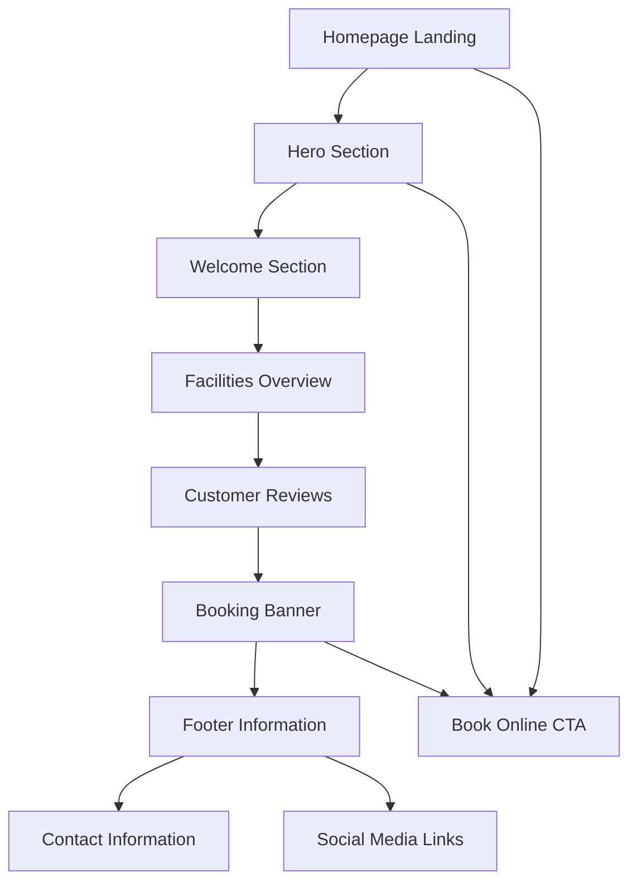

# Lamb Cottage Caravan Park Website - Product Requirements Document

## 1. Product Overview

Modern responsive homepage rebuild for Lamb Cottage Caravan Park using Astro framework with TailwindCSS, maintaining original structure, colors, and branding while implementing clean, minimal design principles.

The project aims to modernize the existing caravan park website with enhanced user experience, improved mobile responsiveness, and contemporary web technologies while preserving the established brand identity and content structure.

## 2. Core Features

### 2.1 User Roles

| Role | Registration Method | Core Permissions |
|------|---------------------|------------------|
| Website Visitor | No registration required | Can browse all content, submit contact forms, view reviews |
| Content Administrator | Admin panel login | Can edit page content, manage images, update facility information |
| Site Owner | Admin panel login | Full access to CMS, email management, analytics, and site configuration |

### 2.2 Feature Module

Our Lamb Cottage Caravan Park website consists of the following main sections:

1. **Top Bar**: Contact links, social media icons, quick access links
2. **Header**: Logo display, primary booking call-to-action
3. **Navigation Menu**: Main site navigation with hover effects
4. **Hero Section**: Full-width aerial imagery with overlay text and CTAs
5. **Welcome Section**: Park introduction with descriptive content and imagery
6. **Tagline Banner**: Brand positioning statement
7. **Facilities Section**: Luxury amenities showcase with icon grid
8. **Property Sales Section**: Holiday homes promotion area
9. **Customer Reviews**: TripAdvisor integration with live review feeds
10. **Contact Form**: Amazon SES-powered contact system with auto-responses
11. **Booking Banner**: Urgency-driven booking encouragement
12. **Footer**: Comprehensive site information and contact details
13. **Content Management System**: Powerful page editing capabilities for non-technical users
14. **Email Management**: Automated email delivery and notification system

### 2.2 Page Details

| Page Name | Module Name        | Feature Description                                                                                                                                                                                                                                                                                |
| --------- | ------------------ | -------------------------------------------------------------------------------------------------------------------------------------------------------------------------------------------------------------------------------------------------------------------------------------------------- |
| Homepage  | Top Bar            | Display contact information, social media links (Facebook, Twitter), "Book Online" quick link with white text on dark green background                                                                                                                                                             |
| Homepage  | Header             | Center-aligned logo with "Lamb Cottage Caravan Park" branding, right-aligned "Book Online" button (dark green with white text)                                                                                                                                                                     |
| Homepage  | Navigation Menu    | Horizontal navigation bar with 7 menu items: Home, About Us, Caravan Holidays, Homes for Sale, Our Photos, Local Attractions, Get in Touch. White text with hover state changing to lighter green                                                                                                  |
| Homepage  | Hero Section       | Full-width aerial park photograph with text overlay: main headline "We invite you to relax and unwind, have a break and leave your stress behind!", subtext about accommodation types, two CTA buttons ("View Our Video Tour" with pink accent and play icon, "Book Online or Enquire" in green)   |
| Homepage  | Welcome Section    | Light mint green background section with left-aligned heading "Welcome to Lamb Cottage Caravan Park" and descriptive text, right-aligned two stacked photographs                                                                                                                                   |
| Homepage  | Tagline Banner     | Full-width gray background banner with centered white uppercase text "A Dog Walkers Paradise in the Heart of Cheshire"                                                                                                                                                                             |
| Homepage  | Facilities Section | Dark caravan photograph background with white heading "We Are Very Proud of Our Five Star, Luxury Facilities", descriptive paragraph, 6-item icon grid (hot water & showers, hairdryers & shower points, equipped suite, fitted laundry, dishwashing & prep area, dog walking area) plus WiFi icon |
| Homepage  | Property Sales     | Green banner with "Property For Sale" heading, gray background content area with "Holiday Homes For Sale" and "View in Detail" outlined button                                                                                                                                                     |
| Homepage  | Customer Reviews   | Light mint green background with "Recent Customer Reviews" heading, live TripAdvisor review feed with rating display, direct links to TripAdvisor profile for review submissions, TripAdvisor certificate badges                                                                                    |
| Homepage  | Booking Banner     | Full-width dark gray background with white bold uppercase text "Avoid Disappointment — Book Early" and "Find Out More" CTA button                                                                                                                                                                  |
| Homepage  | Contact Form       | Dedicated contact section with form validation, multiple inquiry types (general, booking, property sales), Amazon SES email delivery, auto-responder functionality, spam protection, success/error messaging                                                                                        |
| Homepage  | Footer             | Black background four-column layout: social/external links, site summary (dog friendly, open year-round), awards/certifications (AA Gold Award, Best of British, TripAdvisor), contact details (address, phone, email) with copyright bar                                                          |
| CMS Admin | Content Editor     | Visual page editor with drag-and-drop functionality, image management system, SEO optimization tools, content versioning, preview mode, publish/draft status management                                                                                                                              |
| CMS Admin | Email Management   | Email template editor, delivery status monitoring, contact form submission management, auto-responder configuration, email analytics and reporting                                                                                                                                                   |

## 3. Core Process

### 3.1 Visitor User Flow
The main user journey focuses on information discovery and booking conversion:

1. **Initial Landing**: Users arrive at homepage and immediately see hero section with compelling imagery and clear value proposition
2. **Information Gathering**: Users scroll through welcome section, facilities, and live TripAdvisor reviews to understand park offerings
3. **Contact/Inquiry**: Users can submit inquiries through the contact form with automatic email delivery and confirmation
4. **Booking Decision**: Multiple CTA opportunities guide users toward booking (top bar, header, hero section, booking banner)
5. **Review Engagement**: Users can read live TripAdvisor reviews and are directed to leave their own reviews

### 3.2 Content Administrator Flow
1. **Login**: Access CMS admin panel with secure authentication
2. **Content Editing**: Use visual editor to update page content, images, and facility information
3. **Preview**: Review changes before publishing to live site
4. **Publish**: Deploy content updates without technical knowledge
5. **Email Management**: Monitor contact form submissions and configure auto-responses

## 4. User Interface Design

### 4.1 Design Style

* **Primary Colors**: Dark green (#006837) for navigation and primary buttons, Medium green (#4CAF50) for hover states

* **Background Colors**: Light mint green (#E8F5E9) for welcome and review sections, Light gray (#F5F5F5) for neutral areas, Dark gray (#333333) for tagline and booking banners

* **Typography**: Clean, readable fonts with white text on dark backgrounds, dark text on light backgrounds

* **Button Style**: Rounded corners with soft drop shadows, solid fills for primary actions, outlined style for secondary actions

* **Layout Style**: Card-based design with rounded-2xl corners, generous whitespace, full-width sections with contained content

* **Visual Enhancements**: Subtle scroll animations, gradient overlays (from-green-700 to-green-500), soft drop shadows on interactive elements

### 4.2 Page Design Overview

| Page Name | Module Name        | UI Elements                                                                                                                                                              |
| --------- | ------------------ | ------------------------------------------------------------------------------------------------------------------------------------------------------------------------ |
| Homepage  | Top Bar            | Slim horizontal strip, dark green background (#006837), small white text, social media icons, right-aligned quick links                                                  |
| Homepage  | Header             | White background, centered logo with green text and tree graphic, right-aligned dark green button with white text                                                        |
| Homepage  | Navigation         | Full-width horizontal bar, dark green background (#006837), white text navigation items, hover state with medium green (#4CAF50)                                         |
| Homepage  | Hero Section       | Full-width background image, dark overlay for text readability, centered white bold text, two contrasting CTA buttons (pink accent with play icon, green primary button) |
| Homepage  | Welcome Section    | Light mint green background (#E8F5E9), two-column layout, left text content, right stacked images with rounded corners                                                   |
| Homepage  | Tagline Banner     | Full-width dark gray background (#333333), centered white uppercase text, bold typography                                                                                |
| Homepage  | Facilities Section | Dark background image, white text overlay, centered heading and paragraph, 2x3 icon grid on desktop with descriptive text                                                |
| Homepage  | Property Sales     | Green banner header, gray content area below, outlined green button, clean typography                                                                                    |
| Homepage  | Reviews Section    | Light mint green background (#E8F5E9), centered heading, two review cards with rounded corners and drop shadows, action buttons                                          |
| Homepage  | Booking Banner     | Full-width dark gray background (#333333), centered white bold uppercase text, prominent CTA button                                                                      |
| Homepage  | Footer             | Black background (#000000), four-column layout with white text, organized content sections, bottom copyright bar                                                         |

### 4.3 Responsiveness

The website is designed with a desktop-first approach but fully optimized for mobile devices:

* **Navigation**: Collapses into hamburger menu on mobile devices

* **Hero Section**: Text scales appropriately and remains centered across all screen sizes

* **Facilities Grid**: 2x3 layout on desktop transforms to single-column stack on mobile

* **Footer**: Four-column desktop layout stacks vertically on mobile devices

* **Touch Optimization**: All interactive elements sized appropriately for touch interaction

* **Content Adaptation**: Text sizes and spacing adjust for optimal mobile readability

