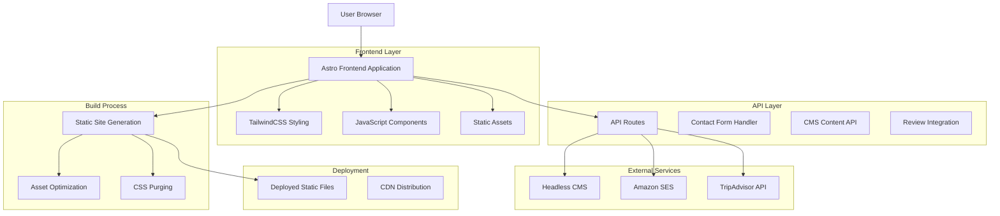

# Lamb Cottage Caravan Park Website - Technical Architecture Document

## 1. Architecture Design



## 2. Technology Description

* **Frontend**: Astro@4 + TailwindCSS@3 + Vite

* **Backend**: Astro API Routes + Node.js runtime

* **Content Management**: Headless CMS (Strapi/Sanity/Contentful)

* **Email Service**: Amazon SES for reliable email delivery

* **Review Integration**: TripAdvisor API for live review feeds

* **Styling**: TailwindCSS with custom color palette configuration

* **Build Tool**: Vite (integrated with Astro)

* **Deployment**: Hybrid rendering (static + server-side for API routes)

## 3. Route Definitions

| Route              | Purpose                                                                    |
| ------------------ | -------------------------------------------------------------------------- |
| /                  | Homepage with all main sections (hero, welcome, facilities, reviews, etc.) |
| /about             | About Us page (future expansion)                                           |
| /caravan-holidays  | Caravan holiday information (future expansion)                             |
| /homes-for-sale    | Holiday homes for sale listings (future expansion)                         |
| /photos            | Photo gallery (future expansion)                                           |
| /local-attractions | Local area attractions (future expansion)                                  |
| /contact           | Contact information and enquiry form (future expansion)                    |

## 4. API Definitions

### 4.1 Contact Form API

Contact form submission with Amazon SES integration
```
POST /api/contact
```

Request:
| Param Name | Param Type | isRequired | Description |
|------------|------------|------------|-------------|
| name | string | true | Contact person's full name |
| email | string | true | Contact email address |
| phone | string | false | Contact phone number |
| inquiryType | string | true | Type of inquiry (general, booking, property) |
| message | string | true | Inquiry message content |

Response:
| Param Name | Param Type | Description |
|------------|------------|-------------|
| success | boolean | Submission status |
| message | string | Response message |
| submissionId | string | Unique submission identifier |

### 4.2 CMS Content API

Retrieve dynamic content from headless CMS
```
GET /api/content/{contentType}
```

Response:
| Param Name | Param Type | Description |
|------------|------------|-------------|
| content | object | CMS content data |
| lastModified | string | Last update timestamp |

### 4.3 TripAdvisor Reviews API

Fetch live reviews from TripAdvisor
```
GET /api/reviews/tripadvisor
```

Response:
| Param Name | Param Type | Description |
|------------|------------|-------------|
| reviews | array | Array of review objects |
| rating | number | Overall rating score |
| totalReviews | number | Total number of reviews |

## 5. Component Architecture

### 4.1 Core Components

**Layout Components**

```typescript
// Base layout structure
interface LayoutProps {
  title: string;
  description?: string;
  image?: string;
}
```

**Section Components**

```typescript
// Hero section component
interface HeroSectionProps {
  backgroundImage: string;
  headline: string;
  subtext: string;
  primaryCTA: CTAButton;
  secondaryCTA: CTAButton;
}

// CTA Button interface
interface CTAButton {
  text: string;
  href: string;
  variant: 'primary' | 'secondary' | 'accent';
  icon?: string;
}

// Facilities grid component
interface FacilityItem {
  icon: string;
  title: string;
  description: string;
}

// Review card component
interface ReviewCard {
  platform: 'google' | 'facebook';
  rating: number;
  text: string;
  author?: string;
  date?: string;
}
```

## 5. Styling Architecture

### 5.1 TailwindCSS Configuration

**Custom Color Palette**

```javascript
// tailwind.config.mjs
module.exports = {
  theme: {
    extend: {
      colors: {
        'lamb-green': {
          'dark': '#006837',
          'medium': '#4CAF50',
          'light': '#E8F5E9'
        },
        'lamb-gray': {
          'dark': '#333333',
          'light': '#F5F5F5'
        }
      },
      fontFamily: {
        'sans': ['Inter', 'system-ui', 'sans-serif']
      },
      animation: {
        'fade-in': 'fadeIn 0.6s ease-in-out',
        'slide-up': 'slideUp 0.8s ease-out'
      }
    }
  }
}
```

### 5.2 Component Styling Patterns

**Button Variants**

* Primary: `bg-lamb-green-dark text-white hover:bg-lamb-green-medium`

* Secondary: `border-2 border-lamb-green-dark text-lamb-green-dark hover:bg-lamb-green-dark hover:text-white`

* Accent: `bg-pink-500 text-white hover:bg-pink-600`

**Card Styling**

* Base: `rounded-2xl shadow-lg bg-white`

* Hover: `hover:shadow-xl transition-shadow duration-300`

**Responsive Breakpoints**

* Mobile: `sm:` (640px+)

* Tablet: `md:` (768px+)

* Desktop: `lg:` (1024px+)

* Large Desktop: `xl:` (1280px+)

## 6. Environment Configuration

### 6.1 Required Environment Variables

```bash
# Amazon SES Configuration
AWS_REGION=eu-west-1
AWS_ACCESS_KEY_ID=your_access_key
AWS_SECRET_ACCESS_KEY=your_secret_key
SES_FROM_EMAIL=noreply@lambcottage.co.uk
SES_ADMIN_EMAIL=admin@lambcottage.co.uk

# CMS Configuration
CMS_API_URL=https://your-cms-instance.com/api
CMS_API_TOKEN=your_cms_token

# TripAdvisor Integration
TRIPADVISOR_API_KEY=your_tripadvisor_key
TRIPADVISOR_LOCATION_ID=your_location_id

# Security
JWT_SECRET=your_jwt_secret
ADMIN_PASSWORD_HASH=your_hashed_password
```

### 6.2 Security Considerations

* **API Rate Limiting**: Implement rate limiting for contact form submissions
* **Input Validation**: Server-side validation for all form inputs
* **CSRF Protection**: Cross-site request forgery protection for forms
* **Email Sanitization**: Prevent email injection attacks
* **CMS Authentication**: Secure admin panel access with JWT tokens
* **Environment Variables**: Sensitive credentials stored securely

## 7. File Structure

```
lamb-cottage-website/
├── src/
│   ├── components/
│   │   ├── layout/
│   │   │   ├── Header.astro
│   │   │   ├── Navigation.astro
│   │   │   ├── Footer.astro
│   │   │   └── TopBar.astro
│   │   ├── sections/
│   │   │   ├── HeroSection.astro
│   │   │   ├── WelcomeSection.astro
│   │   │   ├── FacilitiesSection.astro
│   │   │   ├── ReviewsSection.astro
│   │   │   ├── ContactForm.astro
│   │   │   ├── PropertySection.astro
│   │   │   └── BookingBanner.astro
│   │   ├── ui/
│   │   │   ├── Button.astro
│   │   │   ├── Card.astro
│   │   │   ├── FormField.astro
│   │   │   └── Icon.astro
│   │   └── admin/
│   │       ├── CMSEditor.astro
│   │       └── EmailDashboard.astro
│   ├── layouts/
│   │   ├── BaseLayout.astro
│   │   └── AdminLayout.astro
│   ├── pages/
│   │   ├── index.astro
│   │   ├── admin/
│   │   │   ├── index.astro
│   │   │   └── login.astro
│   │   └── api/
│   │       ├── contact.ts
│   │       ├── content/
│   │       │   └── [type].ts
│   │       └── reviews/
│   │           └── tripadvisor.ts
│   ├── lib/
│   │   ├── aws-ses.ts
│   │   ├── cms-client.ts
│   │   ├── tripadvisor.ts
│   │   └── auth.ts
│   ├── styles/
│   │   └── global.css
│   └── assets/
│       ├── images/
│       └── icons/
├── public/
│   ├── lamb-cottage-logo.png
│   └── favicon.ico
├── .env.example
├── astro.config.mjs
├── tailwind.config.mjs
├── package.json
└── README.md
```

## 8. Performance Optimization

### 8.1 Hybrid Rendering Strategy

* Static generation for content pages with optimal loading speed

* Server-side rendering for API routes and dynamic content

* Incremental Static Regeneration (ISR) for CMS content updates

* Edge caching for API responses

### 8.2 Content Management Optimization

* CMS content caching with TTL (Time To Live)

* Background content synchronization

* CDN integration for CMS assets

* Optimized image delivery from CMS

### 8.3 Email Performance

* Asynchronous email sending to prevent form delays

* Email queue management for high volume

* Template caching for faster email generation

* Delivery status monitoring and retry logic

### 8.4 API Performance

* Response caching for TripAdvisor reviews

* Rate limiting to prevent API abuse

* Connection pooling for database operations

* Gzip compression for API responses

### 8.5 Traditional Optimizations

* WebP format with fallbacks for images

* Responsive image sizing and lazy loading

* TailwindCSS purging for minimal CSS bundle

* Critical CSS inlining and unused style removal

## 8. Responsive Design Implementation

### 8.1 Breakpoint Strategy

* Mobile-first approach with progressive enhancement

* Flexible grid systems using CSS Grid and Flexbox

* Responsive typography scaling

### 8.2 Component Responsiveness

* Navigation: Hamburger menu implementation for mobile

* Facilities Grid: CSS Grid with responsive column counts

* Footer: Flexbox layout with wrapping columns

* Hero Section: Responsive text sizing and positioning

## 9. Modern Enhancement Features

### 9.1 Animations

* Intersection Observer API for scroll-triggered animations

* CSS transitions for hover states

* Subtle fade-in and slide-up effects

### 9.2 Visual Enhancements

* CSS gradients for background overlays

* Box shadows with multiple layers

* Rounded corners using TailwindCSS utilities

* Smooth scrolling behavior

### 9.3 Accessibility

* Semantic HTML structure

* ARIA labels for interactive elements

* Keyboard navigation support

* Color contrast compliance (WCAG 2.1 AA)

